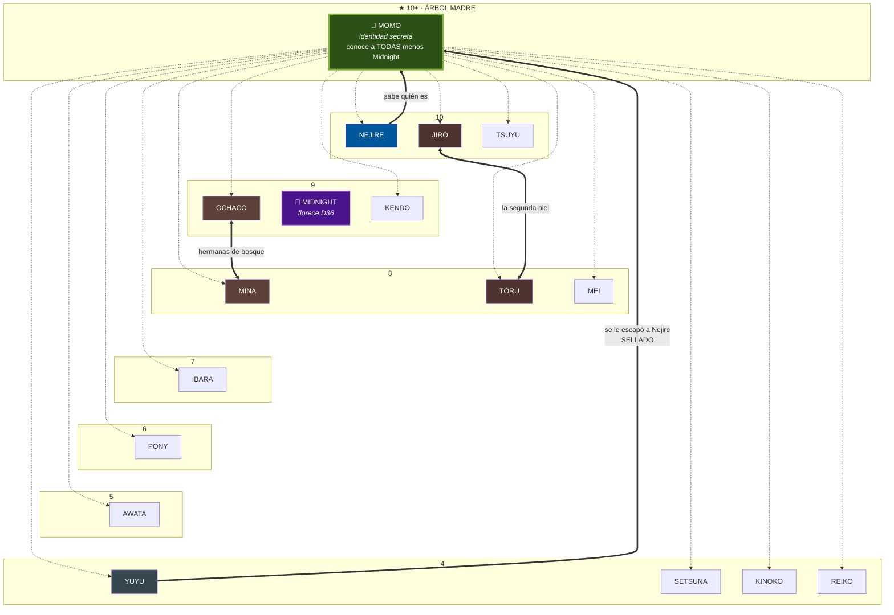

# Niebla del bosque — quién conoce a quién

> ⚠️ **VERDAD VIGENTE = sección §S29/D37 al final (estrella→RED).** El cuerpo de abajo refleja el estado PRE-S29 (grafo de estrella, Midnight como deuda de marco abierta, Momo sin saber de Midnight) y se conserva como HISTÓRICO — no como estado actual. Ver el apéndice S29 para: nodos encendidos, Midnight ya conoce el árbol, cerrojo de Kendo abierto.

> **Regla base** ([[niebla-informacion-npc]]): cada flor sabe **sólo** lo que presenció o lo que le contaron. **No se cruza información entre NPCs.** Que dos personas estén en el bosque no significa que se conozcan como tales.
>
> **Momo es el ÁRBOL MADRE**: la única que hoy conoce a todas — **excepto a Midnight**, que es la deuda de marco abierta del D36.
>
> **La identidad de Momo es SECRETA.** Sólo se revela si ella quiere. Akari puede dar todos los demás nombres, el suyo no. **La conocen dos: Nejire (por derecho) y Yuyu (por un escape de Nejire, sellado).**

## Grafo

> **Bandas horizontales por closeness.** Momo va sola en la banda **10+**: no es un peldaño más, es el eje.
>
> **Las flechas sólo existen si hay conocimiento real.** El vacío significa que no se conocen.
>
> **Punteadas** = Momo las conoce (una por flor). **Gruesas** = las cuatro relaciones que no pasan por ella: las dos que suben a su identidad y las dos únicas horizontales.
>
> 🌙 **Midnight es el único nodo sin flecha punteada.** Ese hueco es la deuda de marco del D36.

**Fuera del grafo por definición:** **AKARI**, que conoce a todas y es el único radio de cada una. Dibujar sus diecisiete aristas sólo taparía lo que importa.

**Quince punteadas y cuatro gruesas.** Tapa las de Momo y quedan **cuatro líneas en diecisiete flores**: ése es el mapa real.

## Lectura del grafo

- **Cuatro aristas.** Diecisiete flores y sólo cuatro líneas. El bosque **no es una red: es una estrella**, y cada radio existe por separado.
- **Dos aristas suben** (hacia Momo) y **dos son horizontales**. Las horizontales son las únicas relaciones entre iguales que existen: **Ochaco ↔ Mina** ("hermanas de bosque", S20/D25) y **Jirō ↔ Tōru** (la segunda piel como espejo, S20). Las dos nacieron de un destape **deliberado**.
- **De las dos que suben, sólo una es legítima.** Nejire lo sabe por derecho; Yuyu por un escape.
- **Trece flores no tienen ninguna arista.** Saben que hay un bosque; no saben quién más lo habita. Y no lo sabrán salvo que Akari lo decida.
- **Yuyu está en la banda 4 y conoce más que las de la banda 10.** El closeness mide el vínculo, no el acceso — y esa asimetría es un riesgo abierto, no una curiosidad.

## Lo que Akari puede ofrecer (declarado S28)

A **Ochaco**, si ella lo pide: **todos los nombres menos el de Momo.** El de Momo es secreto y sólo lo levanta ella.

## Quién conoce la identidad de Momo — CONFIRMADO (S28)

**Dos personas, y la segunda por accidente:**

1. **NEJIRE** — corona. Lo sabe por derecho propio.
2. **YUYU** — **se le escapó a Nejire** (S27). Confirmado por el jugador en S28: no es sólo el apellido, **la conoce**. Gestionado como leak y **sellado**.

De ese escape nace el **protocolo OPSEC de 3 reglas** que Momo redactó para Nejire y entregó el D36: *apellidos sólo dentro del perímetro · ¿protege o sólo emociona? · si falla, se dice y se repara sin esconderlo*. **Formación, no sanción** — porque *"no falla por descuido, falla por generosidad"*.

## Pendiente de niebla (D36)

🔴 **Momo no sabe lo de Midnight.** Floración nueva → deuda de marco, y con Midnight **cara a cara**, no por mensaje.

---

## 🌳 ACTUALIZACIÓN S29 / D37 — DE ESTRELLA A RED

**El bosque ya NO es una estrella pura.** Akari abrió la política de "dar luz al bosque": revelar las flores entre sí, poco a poco, a todas las que no se nieguen activamente, con el ÁRBOL (Momo) siempre oculto.

**Nodos encendidos el D37** (cada flor de un nodo sabe que las otras del nodo comparten a Akari; NO se cruzan secretos hondos):
- **Nodo 1**: Tsuyu · Mina · Ochaco (Ochaco↔Mina ya se conocían; Tsuyu es la nueva luz).
- **Nodo 2 (banda)**: Jirō · Tōru · **Reiko/Banshee** (se conocían de la banda, no como flores; ahora sí).
- **Nodo 3**: Ibara · Pony · **Kinoko** (recién florecida).
- **Nodo 4**: Yuyu · Nejire (+ Mei aterrizada). Yuyu inaugurada.

**Reglas vigentes de la red**:
- **La identidad de Momo (árbol) sigue SECRETA.** Solo la saben: Akari, **Yuyu** (apellido sellado) y **Midnight** (revelada por la propia Momo, S29). Dar luz a las flores ≠ descubrir el tronco.
- **Kendo = cerrojo LEVANTADO (S29, por Setsuna).** Antes se había negado a saber del resto; abrió la puerta para liberar a Setsuna. **Setsuna** queda conectable al bosque (pendiente de presentar).
- **Awata**: elige su propia "estación de lluvias"; no metida en nodo — preguntarle si quiere uno.
- Cada presentación respeta el "no forzar": si una flor prefiere no saber del resto, se para.
- **Midnight** conoce savia/vínculo + el árbol (secreto de estado). **Anan/Trece** conoce savia/raíces/avatares (capa VISIBLE, NO el temporal/muertes); pacto de confidencialidad mutua.
